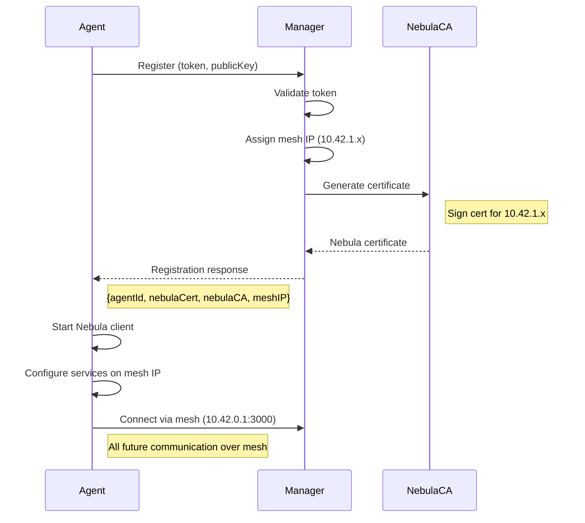

# Mesh Network Design for Control Center

## Executive Summary

To solve the network accessibility challenge where agents cannot directly reach each other across different networks (NAT, firewalls, etc.), we'll implement a lightweight mesh VPN overlay network. This will create a secure, private network where all nodes can communicate directly using internal IP addresses, completely transparent to the end user.

## Recommended Solution: Nebula

After evaluating multiple options, **[Nebula](https://github.com/slackhq/nebula)** by Slack is the optimal choice for Control Center:

### Why Nebula?

1. **Lightweight**: Single static binary (~10MB), minimal CPU/memory usage
2. **Zero External Dependencies**: No coordination servers needed after initial setup
3. **Built-in PKI**: Certificate-based authentication (perfect match for our SSH key model)
4. **Automatic Hole Punching**: Works through NAT/firewalls without manual configuration
5. **Cross-Platform**: Native Go implementation (perfect for our Go agents)
6. **MIT Licensed**: Free to embed and modify

## Alternative Options Evaluated

| Solution | Pros | Cons | Verdict |
|----------|------|------|---------|
| **Tailscale** | Easy setup, great UX | Requires external coordination servers, not self-hosted | ❌ Too dependent on external service |
| **WireGuard** | Fast, modern, kernel-level | Requires manual peer configuration, no built-in mesh routing | ❌ Too low-level for automatic mesh |
| **ZeroTier** | Feature-rich, mature | Requires root/admin, heavier than needed | ❌ Too complex for our needs |
| **Tinc** | True mesh, self-healing | Older codebase, complex configuration | ❌ Configuration complexity |
| **Nebula** | Lightweight, self-contained, Go-native | Newer project (but production-tested at Slack) | ✅ **Best fit** |

## Architecture Design

### Network Topology

```
┌─────────────────────────────────────────────────────────┐
│                  PHYSICAL NETWORKS                       │
│                                                          │
│  Network A (NAT)        Network B (NAT)      Internet   │
│  ┌─────────────┐       ┌─────────────┐    ┌─────────┐  │
│  │   Agent 1   │       │   Agent 2   │    │ Manager │  │
│  │ 192.168.1.x │       │ 10.0.0.x    │    │ Public  │  │
│  └─────────────┘       └─────────────┘    │   IP    │  │
│                                            └─────────┘  │
└─────────────────────────────────────────────────────────┘
                            │
                     Nebula Overlay
                            │
┌─────────────────────────────────────────────────────────┐
│                    NEBULA MESH NETWORK                   │
│                     (10.42.0.0/16)                       │
│                                                          │
│  ┌─────────────┐       ┌─────────────┐    ┌─────────┐  │
│  │   Agent 1   │◄─────►│   Agent 2   │◄──►│ Manager │  │
│  │  10.42.1.1  │       │  10.42.1.2  │    │10.42.0.1│  │
│  └─────────────┘       └─────────────┘    └─────────┘  │
│         ▲                     ▲                ▲        │
│         └─────────────────────┼────────────────┘        │
│                               │                          │
│                     All nodes can reach                  │
│                     each other directly                  │
└─────────────────────────────────────────────────────────┘
```

### Component Integration

```
Control Center Manager (Node.js)
├── Nebula Lighthouse (coordinator)
│   ├── Certificate Authority (CA)
│   ├── Node Registry
│   └── Lighthouse Service (10.42.0.1:4242)
├── Manager Services
│   ├── API Server → Listen on 10.42.0.1:3000
│   ├── Git Server → Listen on 10.42.0.1:3000
│   └── WebSocket → Listen on 10.42.0.1:3000
└── Nebula Management
    ├── Certificate Generator
    ├── Config Generator
    └── Distribution Service

Control Center Agent (Go)
├── Nebula Client
│   ├── Certificate Store
│   ├── Mesh Interface (nebula0)
│   └── Tunnel Service
├── Agent Services
│   ├── SSH Server → Listen on 10.42.x.x:22
│   ├── Health API → Listen on 10.42.x.x:8088
│   └── WebSocket Client → Connect to 10.42.0.1:3000
└── Service Discovery
    └── Auto-register Nebula IP with Manager
```

## Implementation Plan

### Phase 1: Nebula Integration

#### 1.1 Manager Setup (Lighthouse)

```go
// manager/nebula/lighthouse.go
package nebula

type Lighthouse struct {
    ca         *nebula.CA
    configPath string
    process    *exec.Cmd
    network    string // "10.42.0.0/16"
}

func (l *Lighthouse) Initialize() error {
    // 1. Generate CA certificate
    ca, err := GenerateCA("Control Center CA")

    // 2. Generate lighthouse certificate
    cert, err := ca.SignCert("manager", "10.42.0.1/32")

    // 3. Create nebula config
    config := &NebulaConfig{
        PKI: PKIConfig{
            CA:   ca.PublicKey,
            Cert: cert.Cert,
            Key:  cert.Key,
        },
        StaticHostMap: map[string][]string{
            "10.42.0.1": {GetPublicIP()},
        },
        Lighthouse: LighthouseConfig{
            AmLighthouse: true,
            Interval:     60,
        },
        Listen: ListenConfig{
            Host: "0.0.0.0",
            Port: 4242,
        },
        Tun: TunConfig{
            Dev:   "nebula0",
            IP:    "10.42.0.1/16",
        },
    }

    // 4. Start nebula process
    return l.Start(config)
}
```

#### 1.2 Agent Integration

```go
// nodes/internal/nebula/client.go
package nebula

type NebulaClient struct {
    cert       *Certificate
    lighthouse string
    localIP    string
    process    *exec.Cmd
}

func (n *NebulaClient) Connect(certData, caData []byte) error {
    // 1. Save certificates
    SaveCert(certData, caData)

    // 2. Create config
    config := &NebulaConfig{
        PKI: PKIConfig{
            CA:   caData,
            Cert: certData,
        },
        StaticHostMap: map[string][]string{
            "10.42.0.1": {n.lighthouse},
        },
        Lighthouse: LighthouseConfig{
            AmLighthouse: false,
            Hosts:        []string{"10.42.0.1"},
        },
        Tun: TunConfig{
            Dev: "nebula0",
            IP:  n.localIP + "/16",
        },
    }

    // 3. Start nebula
    return n.Start(config)
}

func (n *NebulaClient) GetMeshIP() string {
    // Return assigned mesh IP (e.g., "10.42.1.5")
    return n.localIP
}
```

### Phase 2: Registration Flow Update



### Phase 3: Service Migration

#### 3.1 Update Service Bindings

```javascript
// manager/src/server.js
const MESH_IP = process.env.MESH_IP || '10.42.0.1';
const PORT = process.env.PORT || 3000;

// Bind to mesh interface
server.listen(PORT, MESH_IP, () => {
    console.log(`Manager listening on mesh network ${MESH_IP}:${PORT}`);
});
```

```go
// nodes/main.go
func (a *Agent) StartServices() error {
    meshIP := a.nebula.GetMeshIP()

    // SSH Server on mesh IP
    a.sshServer.Listen(fmt.Sprintf("%s:22", meshIP))

    // Health endpoint on mesh IP
    http.ListenAndServe(fmt.Sprintf("%s:8088", meshIP), nil)

    // Connect to manager via mesh
    a.wsClient.Connect(fmt.Sprintf("ws://10.42.0.1:3000/ws"))
}
```

#### 3.2 Update Agent Discovery

```go
// When agent connects, it reports its mesh IP
type AgentInfo struct {
    AgentID    string `json:"agentId"`
    MeshIP     string `json:"meshIP"`     // e.g., "10.42.1.5"
    PublicKey  string `json:"publicKey"`
    Hostname   string `json:"hostname"`
}
```

### Phase 4: Workflow Updates

```json
{
  "steps": [
    {
      "type": "ssh-command",
      "config": {
        "target": "agent://agent-uuid-here",
        "_resolved": {
          "meshIP": "10.42.1.5",
          "port": 22
        }
      }
    }
  ]
}
```

## Security Benefits

### 1. End-to-End Encryption
- All traffic encrypted with Curve25519/AES-256-GCM
- Forward secrecy with ephemeral keys
- No traffic readable by ISP or network admin

### 2. Zero-Trust Architecture
- Each node has unique certificate
- Certificates signed by our CA only
- Automatic certificate rotation support

### 3. Network Isolation
- Private IP space (10.42.0.0/16)
- No exposure of real IPs
- Firewall-friendly (outbound UDP only)

### 4. Authentication
- Certificate-based (stronger than passwords)
- Integrated with existing agent identity
- Revocation support

## User Experience

### Complete Transparency
Users won't need to:
- Configure VPNs
- Open firewall ports
- Set up port forwarding
- Know about mesh networking
- Manage certificates

### Automatic Setup
1. Start manager → Lighthouse starts automatically
2. Register agent → Receives mesh certificate automatically
3. Agent connects → Joins mesh automatically
4. Execute workflows → Routes through mesh automatically

### Simplified Addressing
Instead of managing complex NAT traversal:
```
Before: SSH to 73.45.22.11:2222 (might fail behind NAT)
After:  SSH to agent://agent-id (always works via mesh)
```

## Performance Considerations

### Overhead
- **Bandwidth**: ~2-5% overhead for encryption
- **Latency**: <1ms additional for encryption
- **CPU**: Negligible (hardware AES acceleration)
- **Memory**: ~10-20MB per node

### Optimization
- Direct peer-to-peer when possible (no relay)
- Automatic MTU discovery
- Connection pooling
- Lazy connection establishment

## Deployment Scenarios

### Scenario 1: Corporate Network
```
┌──────────────────────────────────────┐
│         Corporate Network             │
│                                       │
│  ┌────────┐  ┌────────┐  ┌────────┐ │
│  │Agent 1 │  │Agent 2 │  │Agent 3 │ │
│  │10.42.1.1│  │10.42.1.2│  │10.42.1.3│ │
│  └────────┘  └────────┘  └────────┘ │
│       ▲           ▲           ▲      │
│       └───────────┼───────────┘      │
│                   │                  │
│              ┌─────────┐             │
│              │ Manager │             │
│              │10.42.0.1│             │
│              └─────────┘             │
└──────────────────────────────────────┘
All communication stays within mesh overlay
```

### Scenario 2: Multi-Site
```
Site A (NAT)          Internet         Site B (NAT)
┌──────────┐                          ┌──────────┐
│ Agent 1  │◄──── Nebula Tunnel ─────►│ Agent 2  │
│10.42.1.1 │                          │10.42.1.2 │
└──────────┘                          └──────────┘
     ▲                                      ▲
     └──────────── Mesh Overlay ───────────┘
                        │
                   ┌─────────┐
                   │ Manager │
                   │10.42.0.1│
                   └─────────┘
                   (Public cloud)
```

### Scenario 3: Hybrid Cloud
```
On-Premise            Cloud             Edge
┌──────────┐      ┌──────────┐      ┌──────────┐
│ Agents   │◄────►│ Manager  │◄────►│IoT Agents│
│10.42.1.x │      │10.42.0.1 │      │10.42.2.x │
└──────────┘      └──────────┘      └──────────┘
                        │
              All connected via Nebula mesh
              Works across any network topology
```

## Migration Path

### Step 1: Parallel Operation (v1.1)
- Add Nebula alongside existing connections
- Test mesh connectivity
- Fallback to direct connections

### Step 2: Mesh-First (v1.2)
- Prefer mesh connections
- Direct connections as fallback
- Monitor stability

### Step 3: Mesh-Only (v2.0)
- Remove direct connection code
- Simplify network configuration
- Full mesh operation

## Code Changes Required

### Manager Changes
```
manager/
├── src/
│   ├── nebula/
│   │   ├── ca.js          # Certificate authority
│   │   ├── lighthouse.js  # Lighthouse service
│   │   └── config.js      # Config generator
│   └── server.js          # Bind to mesh IP
```

### Agent Changes
```
nodes/
├── internal/
│   ├── nebula/
│   │   ├── client.go      # Nebula client
│   │   ├── config.go      # Config management
│   │   └── discovery.go   # Service discovery
│   └── network/
│       └── mesh.go        # Mesh network abstraction
```

## Testing Strategy

### Unit Tests
- Certificate generation
- Config validation
- IP assignment

### Integration Tests
- Manager-Agent connectivity over mesh
- Agent-Agent connectivity
- Failover scenarios

### Performance Tests
- Throughput benchmarks
- Latency measurements
- Connection scaling

## FAQ

**Q: What if Nebula process crashes?**
A: Agent monitors and auto-restarts. Falls back to direct connection if configured.

**Q: How are IPs assigned?**
A: Manager assigns from pool (10.42.1.0/24 for agents). Persisted in database.

**Q: Can we use existing infrastructure?**
A: Yes, Nebula works alongside existing networks. No infrastructure changes needed.

**Q: What about DNS?**
A: We'll use agent IDs mapped to mesh IPs internally. No DNS server needed.

**Q: Mobile/roaming support?**
A: Yes, Nebula handles IP changes automatically. Perfect for laptops/mobile devices.

## Conclusion

Nebula provides the ideal solution for Control Center's mesh networking needs:
- ✅ Lightweight and Go-native
- ✅ Zero-configuration for users
- ✅ Self-contained (no external dependencies)
- ✅ Production-tested at scale
- ✅ Strong security by default
- ✅ Transparent to application layer

This design ensures all agents can communicate securely regardless of network topology, while keeping the system simple and maintainable.