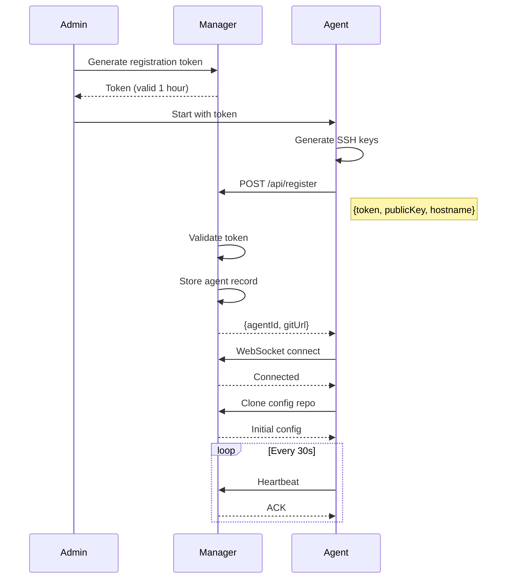
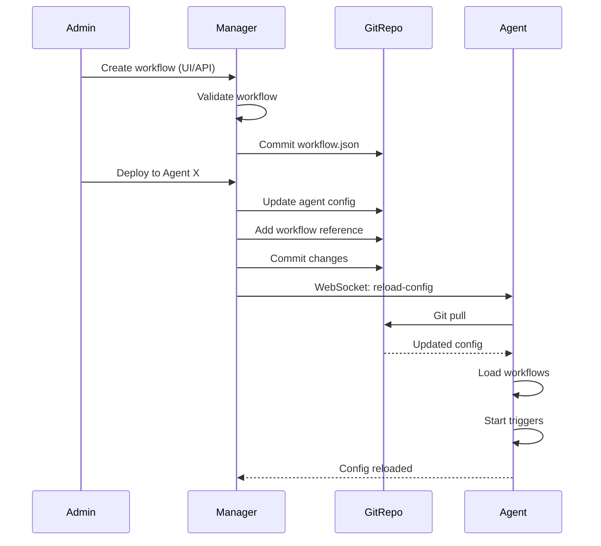
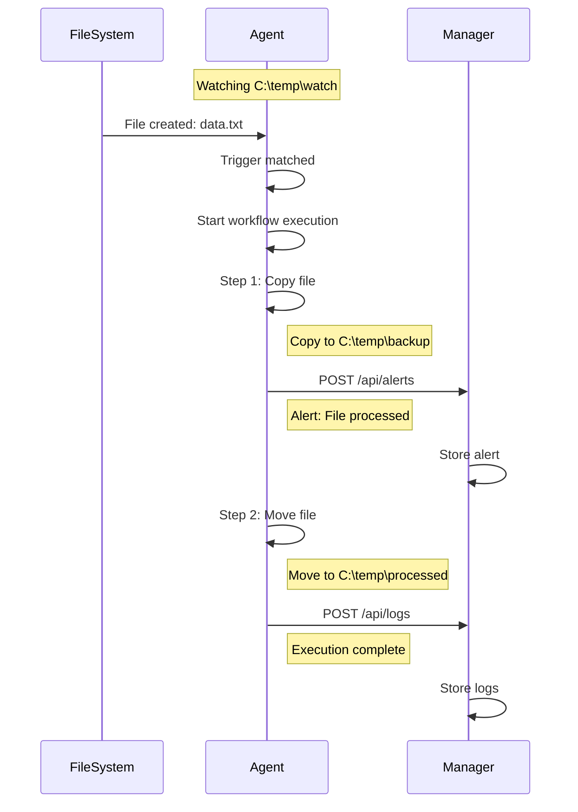
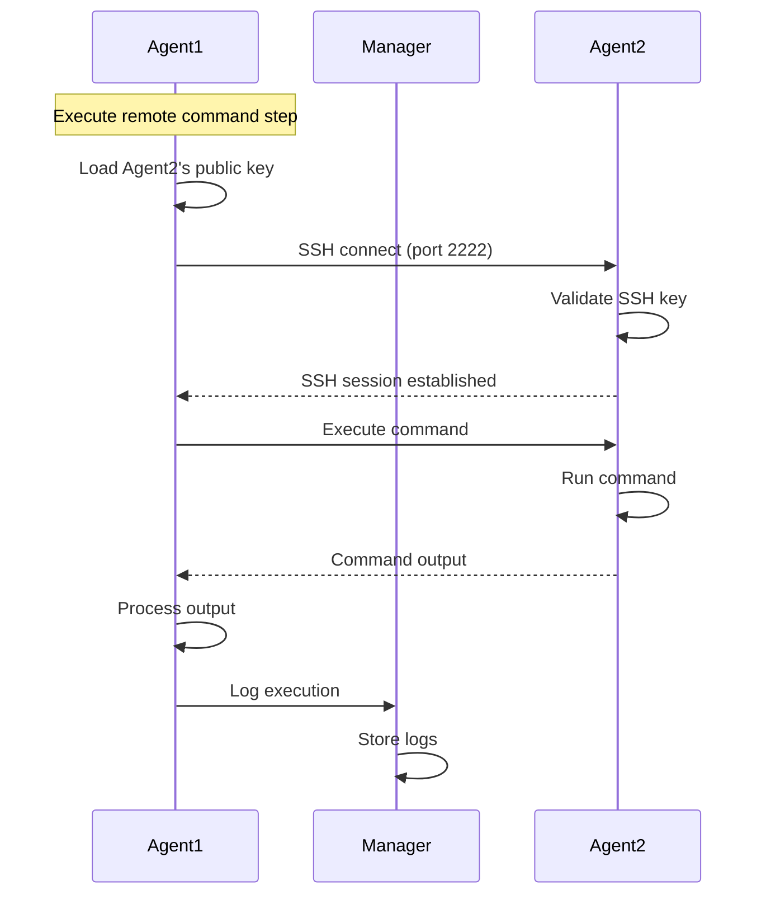
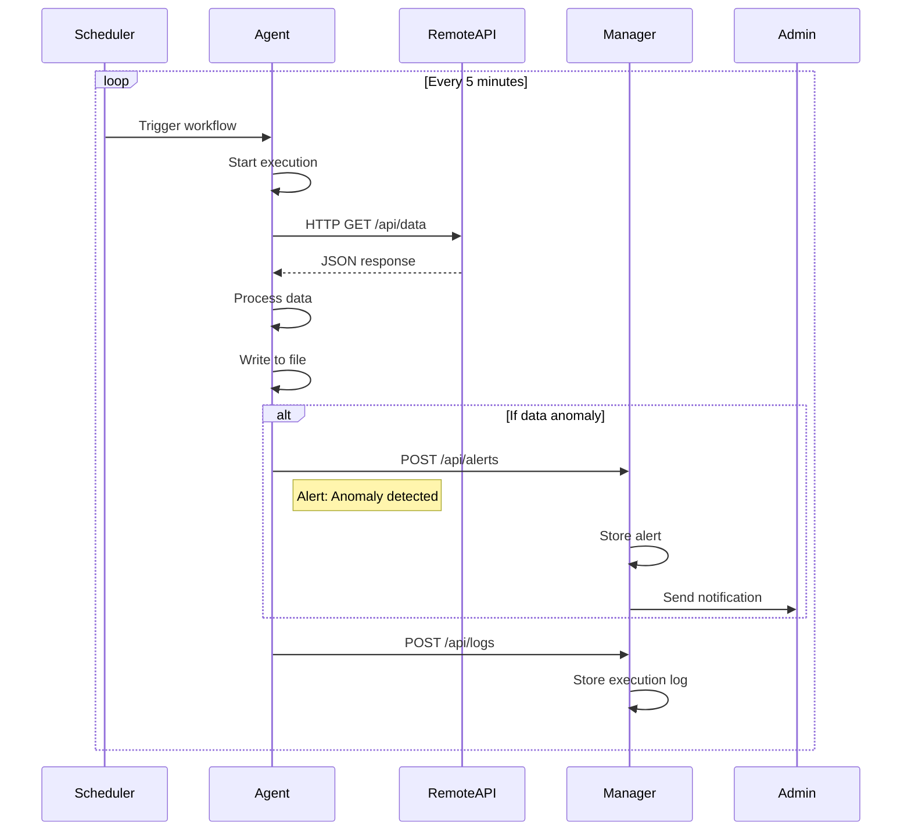
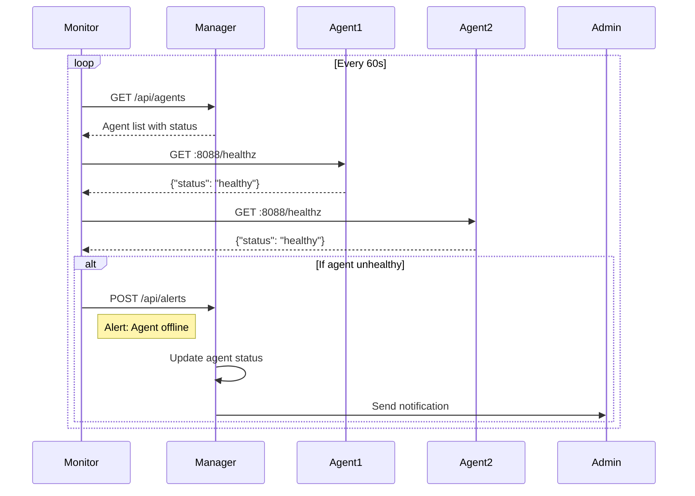

# Control Center System Overview

## Table of Contents
1. [System Architecture](#system-architecture)
2. [Network Communication](#network-communication)
3. [Port Requirements](#port-requirements)
4. [Security Model](#security-model)
5. [Use Cases & Flow Diagrams](#use-cases--flow-diagrams)

## System Architecture

The Control Center uses a hub-and-spoke architecture with centralized management and distributed execution:

```
┌─────────────────────────────────────────────────────────────┐
│                    MANAGER (Node.js)                         │
│  ┌──────────┐  ┌──────────┐  ┌──────────┐  ┌──────────┐   │
│  │  Web UI  │  │   API    │  │WebSocket │  │   Git    │   │
│  │  (EJS)   │  │ (Express)│  │  Server  │  │  Server  │   │
│  └──────────┘  └──────────┘  └──────────┘  └──────────┘   │
│  ┌─────────────────────────────────────────────────────┐   │
│  │               SQLite Database                        │   │
│  │  • Agents  • Workflows  • Alerts  • Logs  • Tokens  │   │
│  └─────────────────────────────────────────────────────┘   │
└─────────────────────────────────────────────────────────────┘
                              │
                              │ WebSocket (Port 3000)
                              │ HTTP/HTTPS (Port 3000)
                              │ Git (Port 3000/git)
                              │
        ┌─────────────────────┼─────────────────────┐
        │                     │                     │
        ▼                     ▼                     ▼
┌──────────────┐      ┌──────────────┐      ┌──────────────┐
│   AGENT 1    │      │   AGENT 2    │      │   AGENT N    │
│     (Go)     │◄────►│     (Go)     │◄────►│     (Go)     │
└──────────────┘ SSH  └──────────────┘ SSH  └──────────────┘
│ • Executor   │      │ • Executor   │      │ • Executor   │
│ • SSH Server │      │ • SSH Server │      │ • SSH Server │
│ • File Watch │      │ • File Watch │      │ • File Watch │
│ • Git Client │      │ • Git Client │      │ • Git Client │
└──────────────┘      └──────────────┘      └──────────────┘
```

## Network Communication

### Communication Protocols

| Protocol | Purpose | Direction | Port |
|----------|---------|-----------|------|
| **HTTP/HTTPS** | Web UI, API, Git | Browser → Manager<br>Agent → Manager | 3000 |
| **WebSocket** | Real-time heartbeat & commands | Agent ↔ Manager | 3000 (upgrade) |
| **SSH** | Agent-to-agent commands | Agent ↔ Agent | 2222 |
| **SFTP** | File transfers | Agent ↔ Agent | 2222 |
| **HTTP** | Health checks | Monitor → Agent | 8088 |

### Communication Flows

#### 1. Manager ↔ Agent Communication
- **Registration**: HTTP POST with token → Manager API
- **Heartbeat**: WebSocket persistent connection (30s intervals)
- **Commands**: WebSocket messages (reload-config, execute-workflow)
- **Configuration**: Git pull from Manager's Git server
- **Alerts**: HTTP POST to Manager API
- **Logs**: HTTP POST to Manager API

#### 2. Agent ↔ Agent Communication
- **SSH Commands**: Direct SSH connection on port 2222
- **File Transfer**: SFTP over SSH on port 2222
- **Authentication**: SSH public key (distributed by Manager)

#### 3. Browser ↔ Manager Communication
- **Web UI**: HTTP/HTTPS on port 3000
- **API Calls**: REST API on port 3000
- **Real-time Updates**: WebSocket upgrade on port 3000

## Port Requirements

### Manager Server

| Port | Protocol | Service | Direction | Required | Notes |
|------|----------|---------|-----------|----------|-------|
| **3000** | TCP | HTTP/WebSocket/Git | Inbound | ✅ Yes | Main service port |
| 443 | TCP | HTTPS | Inbound | Optional | Production TLS |
| 22 | TCP | SSH | Outbound | Optional | Git operations |

### Agent Nodes

| Port | Protocol | Service | Direction | Required | Notes |
|------|----------|---------|-----------|----------|-------|
| **2222** | TCP | SSH/SFTP Server | Inbound | ✅ Yes | Agent-to-agent communication |
| **8088** | TCP | HTTP Health | Inbound | ✅ Yes | Monitoring endpoint |
| 3000 | TCP | HTTP/WebSocket | Outbound | ✅ Yes | Manager connection |
| 2222 | TCP | SSH/SFTP Client | Outbound | Conditional | For remote workflows |

### Firewall Rules Summary

#### Manager Firewall
```bash
# Inbound
ALLOW TCP 3000 FROM any          # Web UI, API, WebSocket, Git
ALLOW TCP 443 FROM any           # HTTPS (optional)

# Outbound
ALLOW TCP 22 TO any              # Git operations (optional)
ALLOW TCP 25/465/587 TO smtp     # Email notifications (optional)
```

#### Agent Firewall
```bash
# Inbound
ALLOW TCP 2222 FROM agents        # SSH/SFTP from other agents
ALLOW TCP 8088 FROM monitoring    # Health checks

# Outbound
ALLOW TCP 3000 TO manager         # Manager connection
ALLOW TCP 2222 TO agents          # SSH/SFTP to other agents
ALLOW TCP 80/443 TO any           # HTTP requests (workflows)
```

## Security Model

### Authentication & Authorization

1. **Agent Registration**
   - One-time token (1-hour expiry)
   - Token validates agent identity
   - Agent receives unique ID

2. **SSH Key Management**
   ```
   Registration:
   Agent → Generate Key Pair → Public Key → Manager

   Distribution:
   Manager → Authorized Keys List → Target Agents

   Authentication:
   Agent A → SSH with Private Key → Agent B (validates with public key)
   ```

3. **WebSocket Security**
   - Agent ID validation
   - Heartbeat timeout (60s)
   - Command authorization

## Use Cases & Flow Diagrams

### Use Case 1: Agent Registration & Setup



### Use Case 2: Workflow Deployment



### Use Case 3: File-Triggered Workflow Execution



### Use Case 4: Cross-Agent Remote Command



### Use Case 5: Scheduled Workflow



### Use Case 6: Manager Health Monitoring



## Data Flow Patterns

### Configuration Distribution
```
Manager → Git Commit → Git Repository
                           ↓
                    Agent Git Pull
                           ↓
                    Local Config Update
                           ↓
                    Reload Workflows
```

### Alert Escalation
```
Workflow Step → Generate Alert → Agent
                                   ↓
                            HTTP POST /api/alerts
                                   ↓
                               Manager DB
                                   ↓
                            Notification Service
                                   ↓
                         Email/Slack/Webhook
```

### Log Aggregation
```
Workflow Execution → Local Log File
                          ↓
                    Log Shipper (Future)
                          ↓
                    Manager Log Service
                          ↓
                      Central Storage
                          ↓
                    Web UI Log Viewer
```

## System Limits & Scaling

### Current Limits
- **Manager**: Single instance (no HA)
- **Agents**: Up to 1000 per manager (WebSocket connections)
- **Workflows**: Unlimited per agent
- **Log Retention**: 30 days (configurable)
- **Alert History**: 90 days (configurable)

### Scaling Considerations
1. **Horizontal Scaling**: Multiple managers with load balancer (future)
2. **Database**: Migration path to PostgreSQL/MySQL for larger deployments
3. **Log Storage**: External log aggregation (ELK, Splunk)
4. **Git Repository**: External Git server for large configurations
5. **WebSocket**: Redis pub/sub for multi-manager setups (future)

## Deployment Topologies

### Small Deployment (1-10 Agents)
```
Single Manager → Local SQLite → Direct Agent Connections
```

### Medium Deployment (10-100 Agents)
```
Manager with External DB → Git Server → Agent Groups
```

### Large Deployment (100+ Agents)
```
Load Balanced Managers → PostgreSQL → External Git → Log Aggregator
```

## Monitoring & Observability

### Health Endpoints
- **Manager**: `http://manager:3000/api/health`
- **Agent**: `http://agent:8088/healthz`

### Metrics (Future)
- Workflow execution rate
- Failure rates
- Agent connectivity
- Resource utilization
- Alert frequency

### Logging Levels
- **ERROR**: System failures
- **WARN**: Recoverable issues
- **INFO**: Normal operations
- **DEBUG**: Detailed troubleshooting